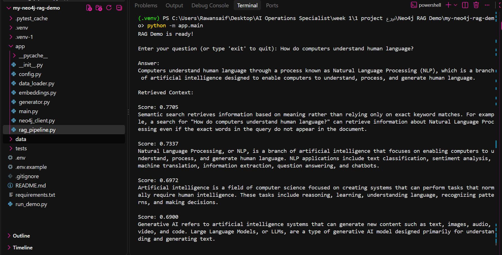
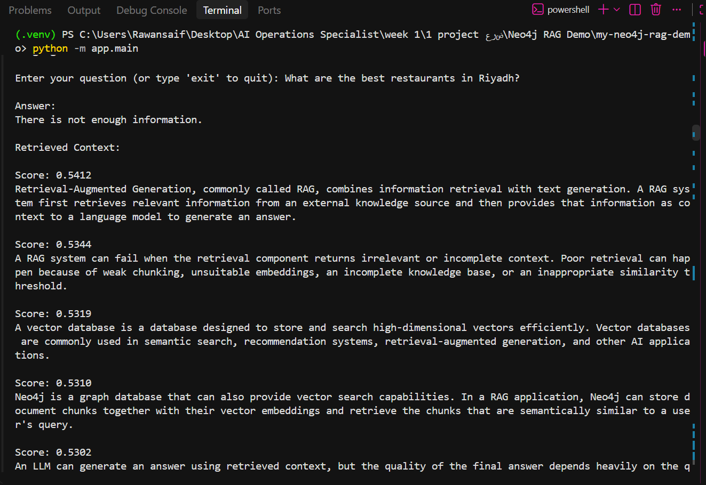
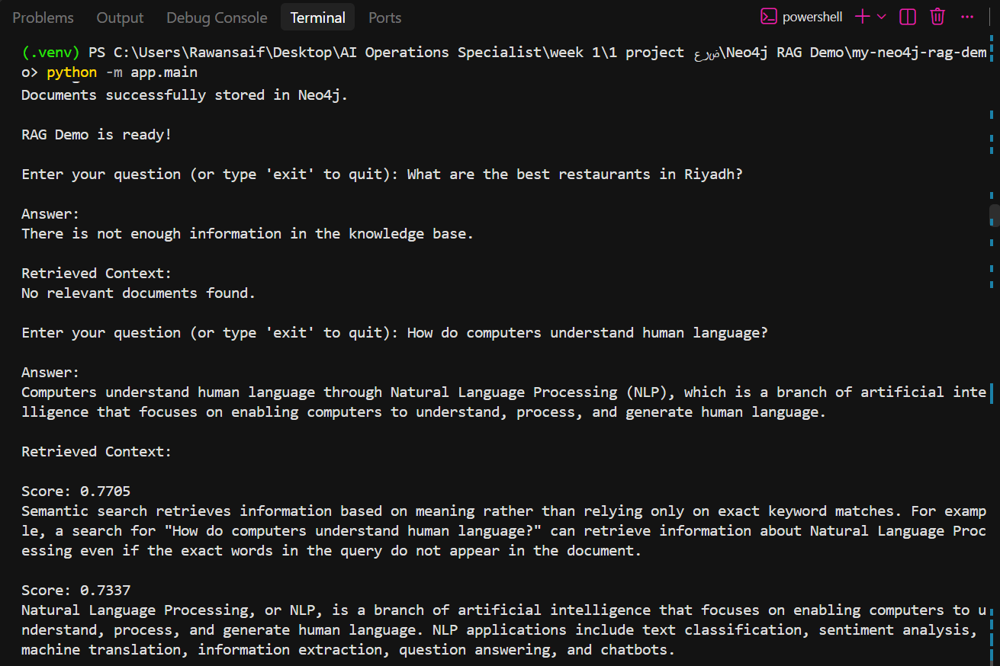

# Neo4j RAG Demo

A beginner-friendly **Retrieval-Augmented Generation (RAG)** pipeline built with **Python, Neo4j, OpenAI embeddings, and an OpenAI LLM**.

This project demonstrates how a RAG system can retrieve semantically relevant information from a vector database and use the retrieved context to generate an answer.

The project is inspired by the [Neo4j RAG Demo](https://github.com/neo4j-examples/rag-demo), but is implemented as an educational project with a simplified architecture and additional retrieval filtering.

> **Educational project — not production-ready.**

---

## Architecture

```text
Documents
    ↓
Document Chunking
    ↓
OpenAI Embeddings
    ↓
Neo4j Vector Database
    ↓
Semantic Retrieval
    ↓
Similarity Threshold
    ↓
Retrieved Context
    ↓
OpenAI LLM
    ↓
Final Answer
```

### RAG Flow

1. The system loads documents from the local knowledge base.
2. Documents are split into smaller chunks.
3. Each chunk is converted into an embedding using OpenAI.
4. The embeddings are stored in Neo4j.
5. A user question is converted into an embedding.
6. Neo4j performs vector similarity search using cosine similarity.
7. Retrieved chunks are filtered using a similarity threshold.
8. Relevant context is sent to the LLM.
9. The LLM generates the final answer using the retrieved context.

---

## Features

* Real OpenAI embeddings
* Neo4j as a vector database
* Semantic vector search
* Cosine similarity
* Similarity threshold filtering
* LLM-based answer generation
* Retrieved context displayed with similarity scores
* Environment-based configuration
* Unit tests for core components
* Good retrieval example
* Poor retrieval example
* No-information handling
* Beginner-friendly modular architecture

---

## Technologies

| Technology        | Purpose                                  |
| ----------------- | ---------------------------------------- |
| Python            | Main programming language                |
| Neo4j             | Vector database and similarity search    |
| OpenAI Embeddings | Convert text into vector representations |
| OpenAI LLM        | Generate answers from retrieved context  |
| python-dotenv     | Environment variable management          |
| pytest            | Unit testing                             |

---

## Project Structure

```text
my-neo4j-rag-demo/
│
├── app/
│   ├── __init__.py
│   ├── config.py
│   ├── data_loader.py
│   ├── embeddings.py
│   ├── generator.py
│   ├── neo4j_client.py
│   ├── rag_pipeline.py
│   └── main.py
│
├── data/
│   └── sample_documents.txt
│
├── images/
│   ├── good-retrieval.png
│   ├── poor-retrieval.png
│   └── no-information.png
│
├── tests/
│   ├── __init__.py
│   ├── test_chunking.py
│   └── test_retrieval.py
│
├── .env.example
├── .gitignore
├── README.md
├── requirements.txt
└── run_demo.py
```

---

## Main Components

### `app/config.py`

Loads environment variables and project configuration.

### `app/data_loader.py`

Loads the sample documents from the knowledge base.

### `app/embeddings.py`

Generates real vector embeddings using the configured OpenAI embedding model.

### `app/neo4j_client.py`

Handles the Neo4j connection, stores document chunks and embeddings, creates the vector index, and performs vector similarity search.

### `app/generator.py`

Sends the retrieved context and user question to the configured OpenAI LLM and generates the final answer.

### `app/rag_pipeline.py`

Coordinates the complete RAG workflow:

```text
Load → Chunk → Embed → Store → Retrieve → Filter → Generate
```

### `app/main.py`

Runs the interactive command-line RAG demo.

### `data/sample_documents.txt`

Contains the sample knowledge base used by the demo.

### `tests/`

Contains unit tests for document chunking and retrieval behavior.

---

## Requirements

* Python 3.10+
* Neo4j database
* OpenAI API key

---

## Installation

### 1. Clone the repository

```bash
git clone https://github.com/Rawansaif202188/Neo4j-RAG-Demo.git
cd Neo4j-RAG-Demo
```

### 2. Create a virtual environment

#### Windows

```bash
python -m venv .venv
.venv\Scripts\activate
```

#### macOS / Linux

```bash
python -m venv .venv
source .venv/bin/activate
```

### 3. Install dependencies

```bash
pip install -r requirements.txt
```

---

## Environment Variables

Create a `.env` file based on `.env.example`.

Example:

```text
NEO4J_URI=bolt://localhost:7687
NEO4J_USERNAME=neo4j
NEO4J_PASSWORD=your_password_here

OPENAI_API_KEY=your_openai_api_key_here
OPENAI_EMBEDDING_MODEL=text-embedding-3-small
OPENAI_LLM_MODEL=gpt-4o-mini
```

> **Security:** Never commit your `.env` file or expose your API keys.

The `.env` file is excluded from Git using `.gitignore`.

---

## Running the Demo

Run the application with:

```bash
python run_demo.py
```

The application will:

1. Load the sample documents.
2. Split them into document chunks.
3. Generate embeddings for the chunks.
4. Store the chunks and embeddings in Neo4j.
5. Generate an embedding for the user's question.
6. Retrieve semantically similar chunks from Neo4j.
7. Filter weak results using a similarity threshold.
8. Send the retrieved context to the LLM.
9. Generate the final answer.

---

## Retrieval and Similarity Threshold

The demo uses a similarity threshold of:

```text
0.65
```

The threshold is used to filter out weak retrieval results before sending context to the LLM.

This value is an **experimental setting for this project** and is not a universal threshold for all RAG systems.

For example:

```text
Query
  ↓
Vector Search
  ↓
Retrieved Results
  ↓
Score >= 0.65 ?
  ↓
Yes → Send Context to LLM
  ↓
Generate Answer
```

If no retrieved chunks meet the threshold, the system returns:

```text
There is not enough information in the knowledge base.
```

This helps prevent weak or unrelated retrieval results from being passed to the LLM.

---

# Demo Results

The following examples were tested using the RAG pipeline and demonstrate different retrieval scenarios.

## 1. Good Retrieval

### Question

```text
How do computers understand human language?
```

The system retrieves relevant information related to:

* Natural Language Processing
* Semantic Search
* Artificial Intelligence
* Generative AI

Example retrieval scores included:

```text
0.7705
0.7337
0.6973
0.6900
```

The retrieved chunks are then provided to the LLM as context.

### Screenshot



---

## 2. Poor Retrieval

### Question

```text
What are the best restaurants in Riyadh?
```

This question is unrelated to the project's knowledge base.

The retrieved similarity scores were low:

```text
0.5412
0.5344
0.5319
0.5310
0.5302
```

Because all results were below the `0.65` threshold, they were filtered out.

The system therefore returned:

```text
There is not enough information in the knowledge base.
```

### Screenshot



---

## 3. No Information

When the knowledge base does not contain relevant information for a question, the system does not generate an answer from unrelated context.

Instead, it returns:

```text
There is not enough information in the knowledge base.
```

### Screenshot



---

## Testing

Run the test suite with:

```bash
pytest
```

Expected re
